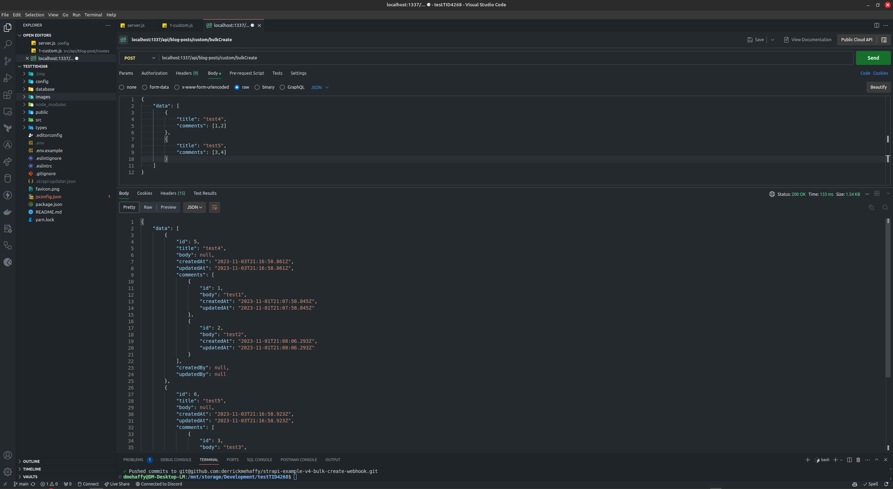
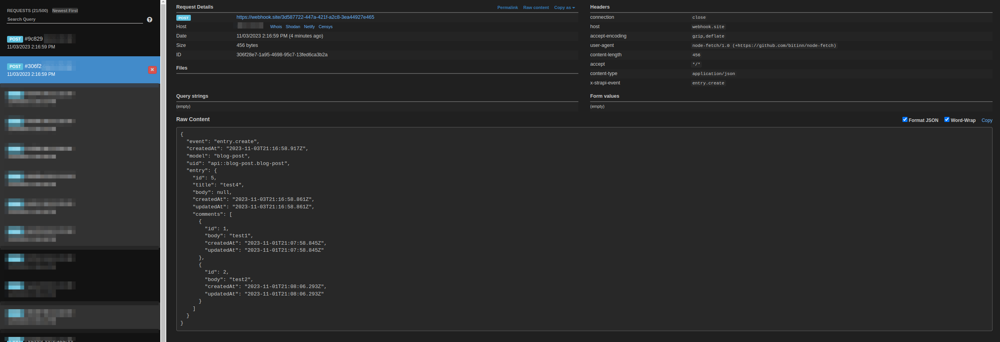
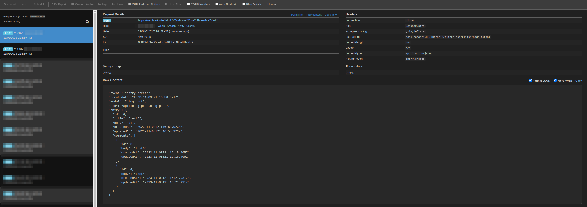

# Bulk create custom route + populated webhook response

You can see in the [server config](config/server.js) that the populate webhooks config is enabled

I created a [custom bulk create route]() and it's related [custom bulk create controller]() to handle the request, below is the sample request/response + both of the webhook responses (each separated).
Generally I would STRONGLY advise against creating a route like this as it makes error handling properly a lot harder but this is just a POC.

## Example Request/Response

## Example Webhook for entry 1

## Example Webhook for entry 2

